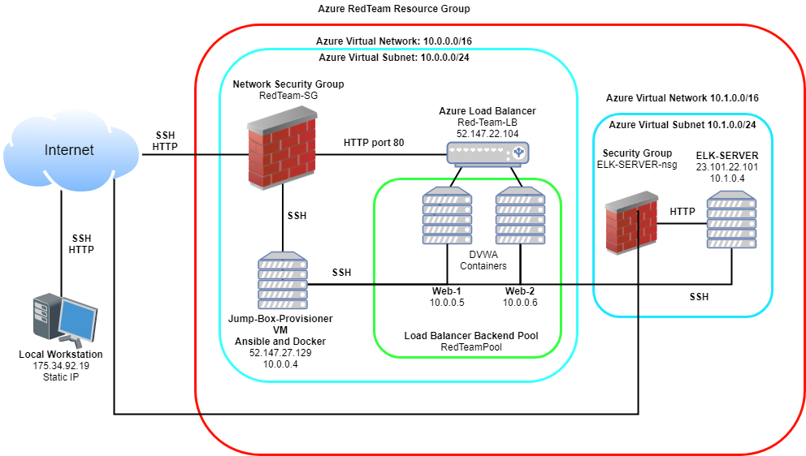
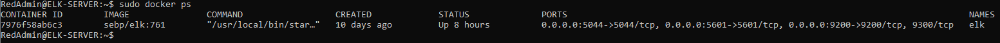

## Automated ELK Stack Deployment

The files in this repository were used to configure the network depicted below.



These files have been tested and used to generate a live ELK deployment on Azure. They can be used to either recreate the entire deployment pictured above. Alternatively, select portions of the playbook file may be used to install only certain pieces of it, such as Filebeat.


This document contains the following details:
- Description of the Topology
- Access Policies
- ELK Configuration
  - Beats in Use
  - Machines Being Monitored
- How to Use the Ansible Build


### Description of the Topology

The main purpose of this network is to expose a load-balanced and monitored instance of DVWA, the Dmn Vulnerable Web Application.

Load balancing ensures that the application will be highly available, in addition to restricting high traffic to the network.

Load balancers can help mitigate against DDoS attacks by rerouting live traffic from one server to another. They also ensure that traffic can be distributed between servers for high functionality and availability.

The advantage of using a jump box is that it is a secure method for connecting to other machines on the network. 

Integrating an ELK server allows users to easily monitor the vulnerable VMs for changes to the network and system logs.

Filebeat monitors log file and locations that you have specified and forwards them to either Elasticsearch or Logstash for indexing.

Metricbeat takes the collected metrics and statistics and ships them to the specified output such as Elasticsearch or Logstash.

The configuration details of each machine may be found below.
_Note: Use the [Markdown Table Generator](http://www.tablesgenerator.com/markdown_tables) to add/remove values from the table_.

| Name                 | Function | IP Address                | Operating System |
|----------------------|----------|---------------------------|------------------|
| Jump-Box-Provisioner | Gateway  | 10.0.0.4 , 52.147.27.129  | Linux            |
| Web-1                | Server   | 10.0.0.5                  | Linux            |
| Web-2                | Server   | 10.0.0.6                  | Linux            |
| ELK-SERVER           | Server   | 10.1.0.4                  | Linux            |

### Access Policies

The machines on the internal network are not exposed to the public Internet. 

Only the Jump-Box-Provisioner machine can accept connections from the Internet. Access to this machine is only allowed from the following IP addresses:

- 175.34.92.19

Machines within the network can only be accessed by Jump-Box-Provisioner.

- The Jump-Box-Provisioner is allowed access to the ELK-SERVER and its IP address is 10.0.0.4

A summary of the access policies in place can be found in the table below.

| Name                 | Publicly Accessible | Allowed IP Addresses |
|----------------------|---------------------|----------------------|
| Jump-Box-Provisioner | Yes                 | 175.34.92.19         |
| Web-1                | No                  | 10.0.0.4             |
| Web-2                | No                  | 10.0.0.4             |
| ELK-SERVER           | No                  | 10.0.0.4             |

### Elk Configuration

Ansible was used to automate configuration of the ELK machine. No configuration was performed manually, which is advantageous because
of the ability to use playbooks which are used to automate tasks. This saves time when configuring multiple machines.

The playbook implements the following tasks:

- Install docker.io
- Install Python3
- Install Python Docker Module
- Download and launch docker web container

The following screenshot displays the result of running `docker ps` after successfully configuring the ELK instance.



### Target Machines & Beats
This ELK server is configured to monitor the following machines:

| Name  | IP Address |
|-------|------------|
| Web-1 | 10.0.0.5   |
| Web-2 | 10.0.0.6   |

We have installed the following Beats on these machines:

Filebeat
Metricbeat

These Beats allow us to collect the following information from each machine:

Filebeat collects log events from specified files. One example of this is system event logs such as modifications.

Metricbeat assists in monitoring by collecting metrics from the system and services running on the server. One example of this is CPU usage on the server.

### Using the Playbook
In order to use the playbook, you will need to have an Ansible control node already configured. Assuming you have such a control node provisioned: 

SSH into the control node and follow the steps below:
- Copy the filebeat-config.yml and metricbeat-config.yml files to /etc/ansible/roles.
- Update the filebeat-config.yml and metricbeat-config.yml files to include the ELK-SERVER private IP 10.1.0.4
- Run the playbook, and navigate to http://23.101.22.101:5601/app/kibana to check that the installation worked as expected.

- filebeat-playbook.yml is the playbook file and this is copied to /etc/ansible/roles

- Which file do you update to make Ansible run the playbook on a specific machine? How do I specify which machine to install the ELK server on versus which to install Filebeat on?_

The hosts file is updated to make Ansible run the playbook on a specific machine.

2 separate groups have been created within the hosts file and these also contain the private IP addresses of the VMs:

webservers
elk

The playbook files contain a hosts paramater that can be used to specify which group to install the files to.

- _Which URL do you navigate to in order to check that the ELK server is running?
http://23.101.22.101:5601/app/kibana
_As a **Bonus**, provide the specific commands the user will need to run to download the playbook, update the files, etc._

```

1 Creating the Filebeat playbook.

This will be created in the /etc/ansible/roles directory: 

Command used to create file: nano /etc/ansible/roles/filebeat-playbook.yml


---
 - name: Installing and Launch Filebeat
   hosts: webservers
   become: yes
   tasks:
     # Use command module
   - name: Download filebeat .deb file
     command: curl -L -O https://artifacts.elastic.co/downloads/beats/filebeat/filebeat-7.6.1-amd64.deb

     # Use command module
   - name: Install filebeat .deb
     command: dpkg -i filebeat-7.6.1-amd64.deb

     # Use copy module
   - name: Drop in filebeat.yml
     copy:
       src: /etc/ansible/files/filebeat-config.yml
       dest: /etc/filebeat/filebeat.yml

     # Use command module
   - name: Enable and Configure System Module
     command: filebeat modules enable system

     # Use command module
   - name: Setup filebeat
     command: filebeat setup

     # Use command module
   - name: Start filebeat service
     command: service filebeat start

   - name: Enable filebeat service
     systemd:
      name: filebeat
      enabled: yes

 
2 Creating the Filebeat configuration file.

This will be created in the /etc/ansible/files directory. The provided template was used and the Private IP for the ELK-SERVER was updated to 10.1.0.4 in this file.

Command used to create: nano /etc/ansible/files/filebeat-config.yml

3 Creating the Metricbeat playbook.

This will be created in the /etc/ansible/roles directory:

Command used to create file: nano /etc/ansible/roles/metric-playbook.yml

---
- name: installing and launching metricbeat
  hosts: webservers
  become: yes
  tasks:

  - name: download metricbeat deb
    command: curl -L -O https://artifacts.elastic.co/downloads/beats/metricbeat/metricbeat-7.6.1-amd64.deb

  - name: install metricbeat deb
    command: dpkg -i metricbeat-7.6.1-amd64.deb

  - name: drop in metricbeat.yml
    copy:
      src: /etc/ansible/files/metricbeat-config.yml
      dest: /etc/metricbeat/metricbeat.yml

  - name: enable and configure system module
    command: metricbeat modules enable docker

  - name: setup metricbeat
    command: metricbeat setup

  - name: start filebeat service
    command: service metricbeat start

  - name: Enable metricbeat service
    systemd:
      name: metricbeat
      enabled: yes
      

  4 Creating the Metricbeat configuration file.

  This will be created in the /etc/ansible/files directory. The provided template was used and the Private IP for the ELK-SERVER was updated to 10.1.0.4 in this file.

  Command used to create: nano /etc/ansible/files/metricbeat-config.yml

  5 The following commands used to run the playbooks:

  ansible-playbook /etc/ansible/rules/filebeat-playbook.yml
  ansible-playbook /etc/ansible/rules/metricbeat-playbook.yml

```


